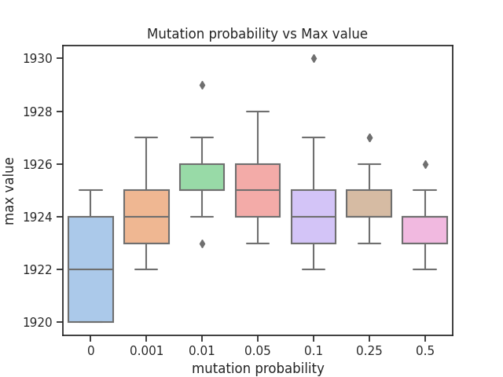

# Genetic algorithm
## Exercise
The point of this exercise was to implement a genetic
algorithm and solve a simple problem regarding a rocket
landing. The rocket is trying to land on a planet in 200 steps.
In each step we can either use fuel or not which in turn changes
the acceleration of the rocket. If the rocket hits the surface
of the planet with too much velocity or flies of into space,
we fail. Otherwise, we succeed.

## Results
I compared how changing the probablity of mutation affected the results.

| Mutation probability        | Average score          | Standard deviation  |
| ------------- |-------------| -----|
| 0    | 1922.08 | 1.76|
| 0.001 | 1924.12      | 1.63 |
| 0.01 | 1925.2      | 1.13 |
| 0.05 | 1925.28      | 1.40 |
| 0.1 | 1924.44      | 1.70  |
| 0.25 | 1924.52      | 1.17 |
| 0.5 | 1923.52      |  1.14 |

If the mutation probability was too low, the algorithm didn't
explore enough, yielding on average lower scores. If it was too
high, the scores would also be lower, because the algorithm
would lose the better scored solutions as a result of
random mutation.

## Used libraries
- numpy - numerical operations
- matplotlib, seaborn - plot creation