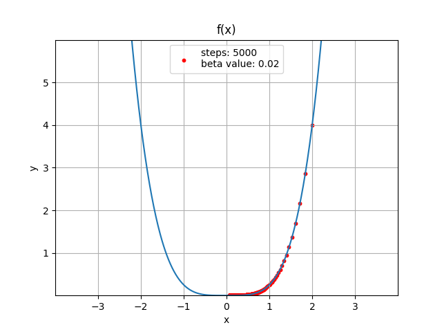
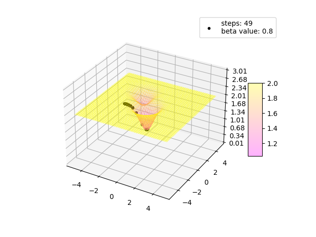
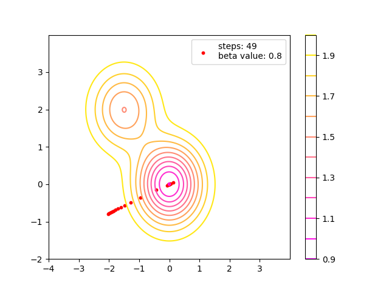

# Gradient descent
## Exercise
The purpose of this exercise was to find minima for the provided
functions.

## Results

### 2D function

### 3D function

  
  

## Used libraries
- numpy - numerical calculations
- matplotlib - plot creation
