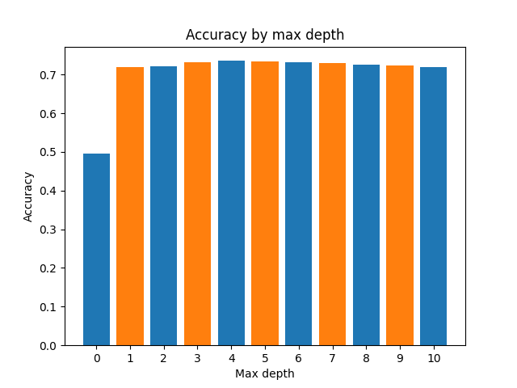

# ID3 algorithm
## Exercise
The point of this exercise was to build a decision tree
using the ID3 algorithm and train it on the [cardiovascular disease detection dataset](https://www.kaggle.com/datasets/bhadaneeraj/cardio-vascular-disease-detection).

## Results
Some of the data required discretization. I also split the data
into train, test and validation datasets.
I tested how setting the maximum tree depth affected the
accuracy of predictions.

Best results were achieved at max depth set to 4.
For depths higher than 0, the accuracy was already close to
the best achieved accuracy - this suggests that the first best
attribute has a significant impact on predicting the outcome.
For depths below 4 the model might be slighly underfit and for depths
above 4 it may be slightly overfit. Final accuracy - around 72%.

## Aditional information
The dataset is available [here](https://www.kaggle.com/datasets/bhadaneeraj/cardio-vascular-disease-detection).

### Used libraries
- numpy - numerical operations
- pandas - dataset operations
- sklearn - train, test, validate data split
- matplotlib - plot creation