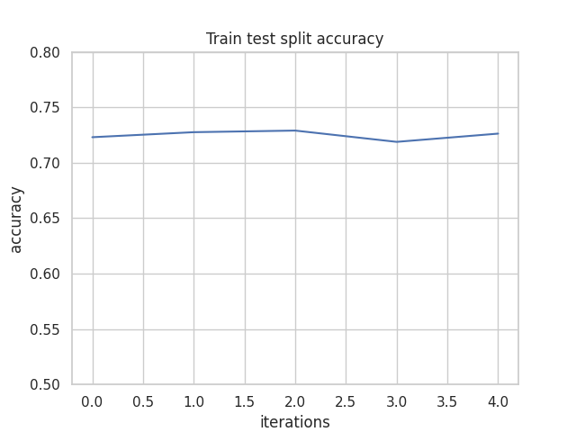

# Naive Bayes
## Exercise
The point of this exercise was to implement a naive Bayes
classifier and test it's effectiveness on the [cardiovascular disease detection dataset](https://www.kaggle.com/datasets/bhadaneeraj/cardio-vascular-disease-detection).

## Results
I compared the effectiveness of using k-Fold cross validation and
the test, train, validate split. I discretized some of the data
and used Laplace smoothing. First I trained the model on the
entire dataset. then I trained it after removing some outliers and
compared results.

### Whole dataset results

  
  

### Reduced dataset results

  
  

Results were similar when trained on the entire dataset.
After removing outliers, the model with k-fold cross validation
started getting worse results after each iteration. It means that
the model was overfit. This suggests that the k-fold cross validation
method is better at detecting overfitting.

## Additional information
The dataset is available [here](https://www.kaggle.com/datasets/bhadaneeraj/cardio-vascular-disease-detection).

### Used libraries
- numpy - numerical operations
- pandas - dataset operations
- sklearn - train, test, validate data split, k-fold cross validation
- matplotlib - plot creation

