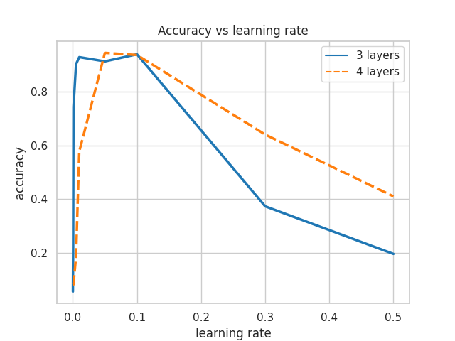
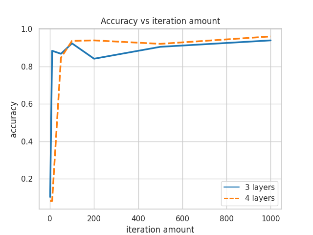

# Neural network
## Exercise
The point of this exercise was to create a multilayered
neural network and train it on the MNIST dataset.

## Results
We tested the accuracy for a 3 and 4 layered network setups as well
as how the learning rate and epoch amount impacted the accuracy.
We implemented the ReLU and the sigmoid activation functions.

### Learning rate

### Epoch amount

## Used libraries
- numpy - numerical operations
- pandas - dataset operations
- scikit - train, test, validate data split and loading the dataset
