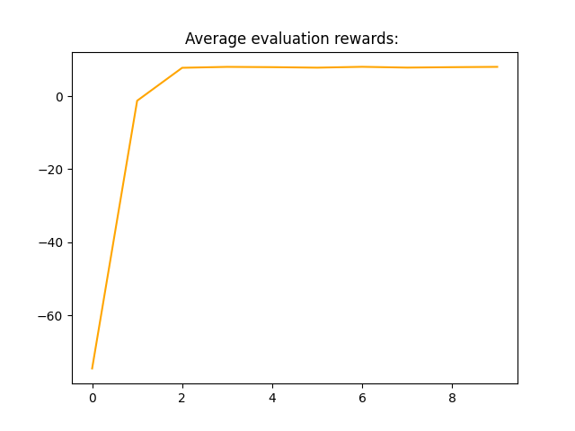
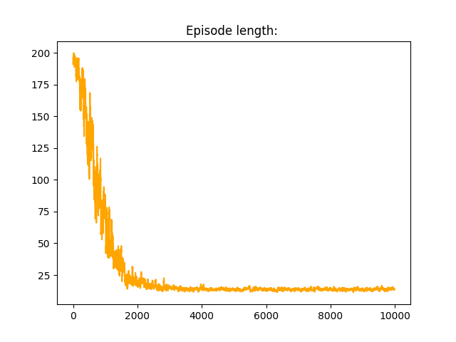
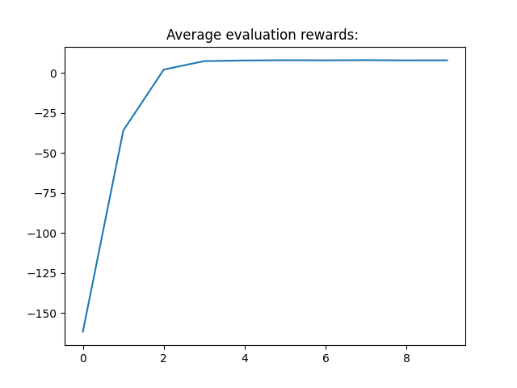
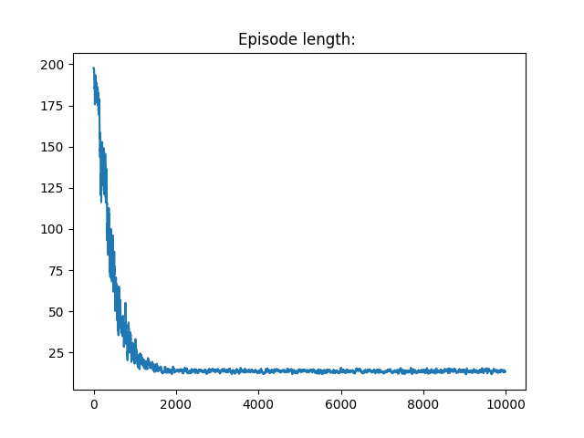

# Qlearning algorithm
## Exercise
The point of this exercise was to implement the qlearning algorithm
and train an agent to solve the taxi problem described [here](https://gymnasium.farama.org/environments/toy_text/taxi/).
I also impleneted and compared the effectiveness of Boltzmann and epsilon-greedy
exploration strategies.

## Results
In the end, both exploration strategies, as well as the decayed epsilon-greedy
strategy produced similar results.

#### Boltzmann strategy:

  
  

#### Epsilon greedy strategy:

  
  

## Used libraries
- numpy - numerical calculations
- gymnasium - environment operations
- matplotlib - plot creation
